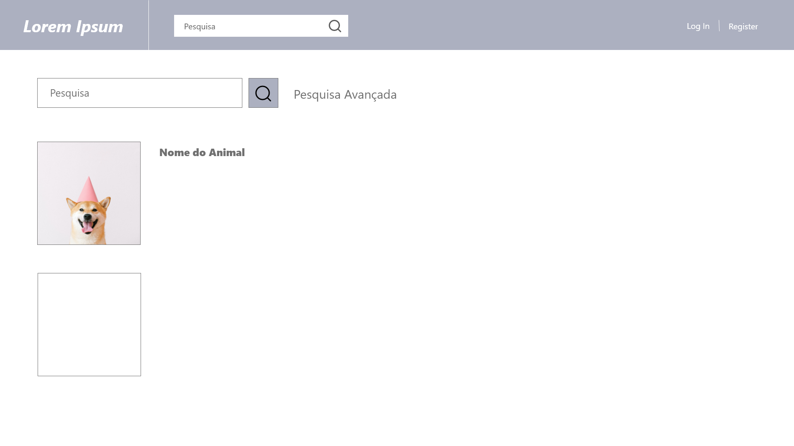
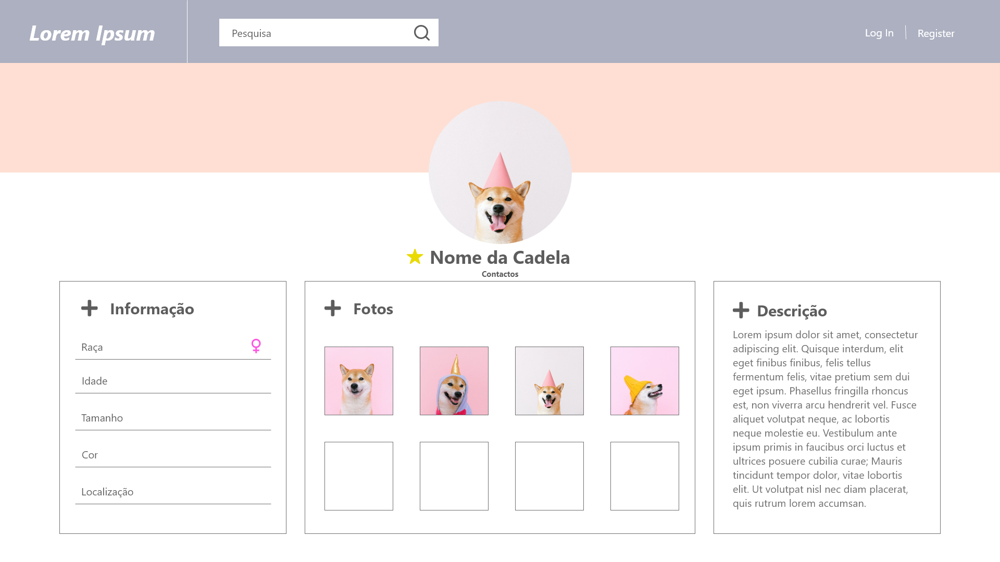
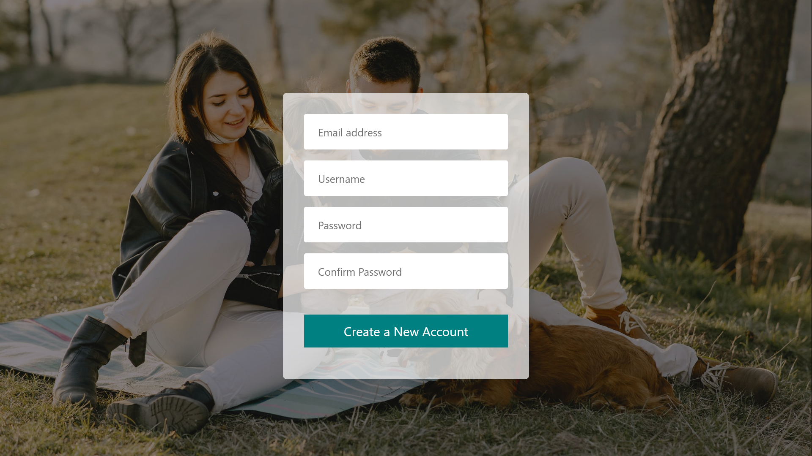

# LTW Project

## Project Description
Create a website where users can list rescue pets for adoption and/or offer them a forever home.

This project was done by:
- *Diogo Samuel Gonçalves Fernandes*
- *Hugo Miguel Monteiro Guimarães*
- *Beatriz Mendes*
- *Inês Quarteu*

---
## Index
1. [Mockups](#Mockups)
2. [UML](#UML)
3. [Code Practices](#Code-Practices)
4. [Features](#Features)
    4.1 [Required Features](#Required-Features)
    4.2 [Extra Features](#Extra-Features)
    4.3 [Security Features](#Security-Features)
---

### Mockups

| Home Page | Profile |
| --- | --- |
|  |  |

| Dog Profile | Dog Information |
| --- | --- |
|  |  |

|Login | Register |
| --- | --- |
|  |  |

---
### UML

---
### Code practices

- All the content should in english
- Git Flow followed (dont commit directly on master, use pull requests, ...)
- Always use 'use strict' at the start of javascript files

---
### Features

#### Required Features
All users should be able to:
- [x] Register a new account.
- [x] Login and logout.
- [x] Edit their profile (username and password at least).

Users that found a pet and are looking for someone to adopt it should be able to:
- [x] Add information about the pet. Including name (if any), species (e.g., dog, cat), size, color, photos, location, ...
- [x] Manage previous postings (like a blog).
- [x] List any questions, inquiries, and adoption proposals.
- [x] Accept or refuse adoption proposals.

Users looking for a pet should be able to:
- [x] Search for a pet using several search criteria.
- [x] Add pets to a favourites list.
- [x] Ask questions about a pet listed for adoption.
- [x] Propose to adopt a pet and list previous proposals.

#### Extra Features

- [x] A slideshow with all pet photos
- [x] A notification menu where users can see if their pet had an adoption proposal

#### Security Features

- [x] Hashed passwords (with SALT)
- [x] Session CSRF Tokens
- [x] XSS attacks prevented (using htmlentities)
- [x] Regex to filter user input

